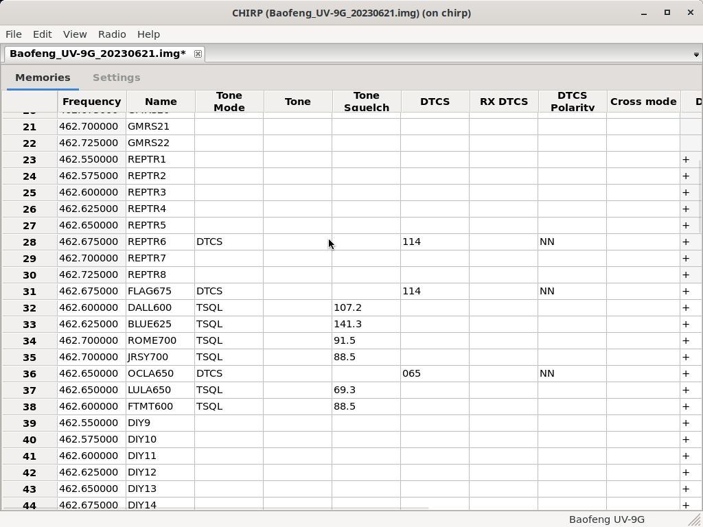

# chirp-on-docker

This is based on the open source CHIRP software: https://chirp.danplanet.com/projects/chirp/wiki/Home

Reference work:
1. Here: https://github.com/linuxluser/docker-chirp
2. And here: https://github.com/mpaolino/docker-chirp

Modifications to reference work:
1. Added docker-compose YAML
2. Improved the Docker file
3. Tested `chirp-on-docker` on a few radios (see below)

Why use Docker:
1. CHIRP uses Python 2 which is deprecated in newer distributions of Ubuntu.
2. Enables self-contained development environment for working with older Linux (Debian) packages supporting CHIRP software without messing with current machine set up
3. Easily update CHIRP software by changing the VERSION parameter in the docker-compose YAML file.

Test radios:
1. Baofeng UV-9G (handheld transceiver) - https://a.co/d/2yVJyV1
2. Baofeng GMRS-9R (handheld transceiver) - https://a.co/d/hjNpcNf
3. BTECH GMRS 50X1 (mobile transceiver) - https://a.co/d/2jHZdSZ

Linux machine set up:
1. Machine: Intel® Core™ i5-6600K CPU @ 3.50GHz × 4 64GB RAM 4TB HD 
2. OS: Ubuntu 22.04 LTS, Budgie Desktop Environment
3. Docker:  
   3.1 Docker version 20.10.22, build 3a2c30b  
   3.2 docker-compose version 1.25.5, build 8a1c60f6
4. Code editor: Visual Studio Code Version: 1.74.2 (Figure 1)
5. Programming cables used:  
   5.1 Baofeng HTs: https://a.co/d/iVTwtpD  
   5.2 BTECH GMRS 50X1: https://a.co/d/dBGAPnp

Figure 1. Visual Studio Code provides a "one-stop shop" for managing code and docker containers.

Updating Linux firmware to detect FTDI chip in the programming cable:
1. Type `lsusb` in the Terminal app. Insert the programming cable in a USB port and type `lsusb` again. If there are no new devices added to the list proceed to #2.
2. Update software - `sudo apt get update` then `sudo apt get upgrade`. The `linux-firmware` package will be upgraded if the installed OS does not have the FTDI drivers.
3. After update, type `lsusb` again. You should now see the list with the new device listed.

Launching `chirp-on-docker`:
1. Clone (`git clone`) this repository.   
2. To build the docker image `chirp`: Run the bash script `build_chirp.sh` in the Terminal app.  
3. To launch `chirp-on-docker`: Run the bash script `start_chirp.sh` in the Terminal app. Before launching, make sure your radio with the programming cable is plugged in to the machine's USB port. (Figure 2). Follow the instructions in the CHIRP software. Data downloaded from the radio should look like Figure 3.
4. Request a radio check on your favorite programmed repeater channel.

Figure 2. `chirp-on-docker` after launch

Figure 3. `chirp-on-docker` with data downloaded from a programmed Baofeng UV9G. Note programmed DIY channels featuring repeaters from the North Georgia GMRS Network.

If you used `chirp-on-docker` and think it's useful or have a question, send me a shout out on one of the North Georgia GMRS Network repeater channels (my Tac Number is Atlanta1205).